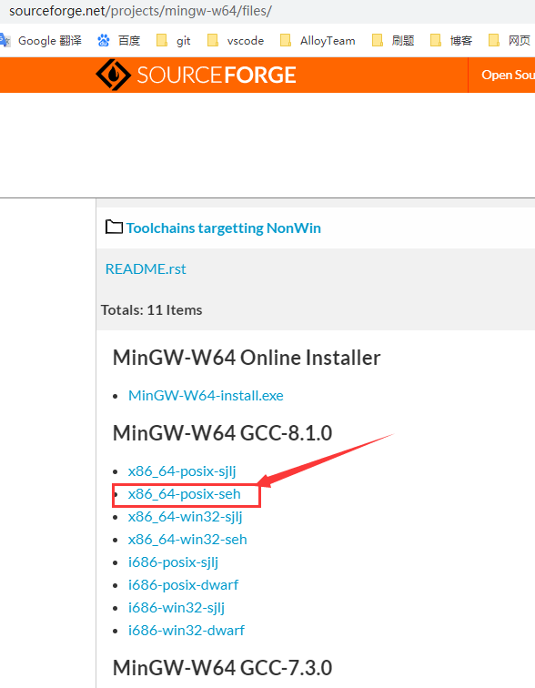
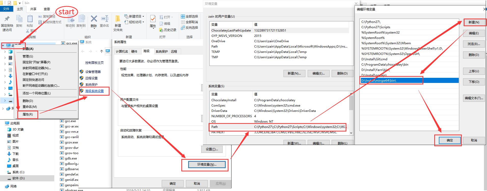

[English](./README.md) | 简体中文

# 目录

>- [说明](#说明)
>- [windows编译及调试环境配置](#编译及调试环境配置)
>    - [CPP](#CPP)
>       - [安装CPP扩展](#安装CPP扩展)
>       - [配置MinGw](#配置MinGw)
>           - [MinGw下载](#MinGw下载)
>           - [MinGw安装及环境变量配置](#MinGw安装及环境变量配置)
>       - [配置vscode_CPP](#配置vscode_CPP)
>           - [launch_CPP](#launch_CPP)
>           - [c_cpp_properties_CPP](#c_cpp_properties_CPP)
>           - [tasks_CPP](#tasks_CPP)
>       - [编译及调试CPP代码](#编译及调试CPP代码)
>    - [JavaScript](#JavaScript)
>       - [配置Nodejs](#配置Nodejs)
>       - [配置vscode_JS](#配置vscode_JS)
>           - [launch_JS](#launch_JS)
>       - [编译及调试JavaScript代码](#编译及调试JavaScript代码)
>    - [Python](#Python)
>       - [安装Python扩展](#安装Python扩展)
>       - [配置Python](#配置Python)
>           - [Python下载](#Python下载)
>       - [配置vscode_Python](#配置vscode_Python)
>           - [launch_Python](#launch_Python)
>           - [settings_Python](#settings_Python)
>       - [编译及调试Python代码](#编译及调试Python代码)

# 说明

>[目录](#目录)

刷题，算法总结，算法库。包含语言：`C/C++`、`JavaScript`、`Python` ...

# 编译及调试环境配置

这里用的是 `vscode` 配置各种语言的编译和调试环境，系统为windows。

## CPP

>[目录](#目录) | [说明](#说明)

### 安装CPP扩展

`vscode` 扩展中心搜索 `C/C++` 下载并安装扩展。

### 配置MinGw

>[目录](#目录) | [说明](#说明)

#### MinGw下载

通过下列链接下载自己喜欢的版本

64位(x64): [https://sourceforge.net/projects/mingw-w64/files/](https://sourceforge.net/projects/mingw-w64/files/)

32位(x86): [https://osdn.net/projects/mingw/releases](https://osdn.net/projects/mingw/releases)

#### MinGw安装及环境变量配置

>[目录](#目录) | [说明](#说明)

这里只介绍 `mingw-w64` 免安装版的配置。

1. 打开链接：[https://sourceforge.net/projects/mingw-w64/files/](https://sourceforge.net/projects/mingw-w64/files/)

2. 单击下图中的链接下载 `mingw-w64` 免安装版（下载的文件名类似：`x86_64-8.1.0-release-posix-seh-rt_v6-rev0.7z`）



3. 将下载好的文件解压到自己喜欢的任意目录。

4. 配置环境变量：按照下图，将对应解压后的 `bin` 文件夹目录添加到环境变量中。



### 配置vscode_CPP

>[目录](#目录) | [说明](#说明)

`./.vscode` 文件夹下添加下列配置文件：[launch.json](./.vscode/launch.json)、[c_cpp_properties.json](./.vscode/c_cpp_properties.json)、[tasks.json](./.vscode/tasks.json)、[settings.json](./.vscode/settings.json)

#### launch_CPP

具体说明见注释，需注意把 `"miDebuggerPath"` 的值改为自己的 `MinGW` 安装路径。

[launch.json](./.vscode/launch.json)

```js
{
    "version": "0.2.0",
    "configurations": [
        {
            "name": "C++ debug (GDB)", // 配置名称，将会在启动配置的下拉菜单中显示
            "type": "cppdbg", // 配置类型，这里只能为cppdbg
            "request": "launch", // 请求配置类型，可以为launch（启动）或attach（附加）
            "targetArchitecture": "x64", // 生成目标架构，一般为x86或x64，可以为x86, arm, arm64, mips, x64, amd64, x86_64
            "program": "${file}.exe", // 将要进行调试的程序的路径
            "miDebuggerPath": "D:\\Install\\mingw64\\bin\\gdb.exe", // miDebugger的路径，注意这里要与MinGw的路径对应
            "args": [
                "zain",
                "jane",
                "ZainJane"
            ], // 程序调试时传递给程序的命令行参数，一般设为空即可
            "stopAtEntry": false, // 设为true时程序将暂停在程序入口处，一般设置为false
            "cwd": "${workspaceRoot}", // 调试程序时的工作目录，一般为${workspaceRoot}即代码所在目录
            "externalConsole": true, // 调试时是否显示控制台窗口，一般设置为true显示控制台
            "preLaunchTask": "g++" // 调试会话开始前执行的任务，一般为编译程序，c++为g++, c为gcc
        }
    ]
}
```

#### c_cpp_properties_CPP

>[目录](#目录) | [说明](#说明)

需注意把 `"compilerPath"` 的值改为自己的 `MinGW` 安装路径，其它设置不变。

[c_cpp_properties.json](./.vscode/c_cpp_properties.json)

```json
{
    "configurations": [
        {
            "name": "MinGW",
            "includePath": [
                "${workspaceFolder}/**"
            ],
            "defines": [
                "_DEBUG",
                "UNICODE",
                "_UNICODE"
            ],
            "windowsSdkVersion": "8.1",
            "compilerPath": "D:\\Install\\mingw64\\bin\\g++.exe",
            "cStandard": "c11",
            "cppStandard": "c++17",
            "intelliSenseMode": "gcc-x64"
        }
    ],
    "version": 4
}
```

#### tasks_CPP

>[目录](#目录) | [说明](#说明)

这个文件不用改动

[tasks.json](./.vscode/tasks.json)

```js
{
    "version": "2.0.0",
    "command": "g++",
    "args": [
        "-g",
        "${file}",
        "-o",
        "${file}.exe"
    ], // 编译命令参数
    "problemMatcher": {
        "owner": "cpp",
        "fileLocation": [
            "relative",
            "${workspaceRoot}"
        ],
        "pattern": {
            "regexp": "^(.*):(\\d+):(\\d+):\\s+(warning|error):\\s+(.*)$",
            "file": 1,
            "line": 2,
            "column": 3,
            "severity": 4,
            "message": 5
        }
    }
}
```

### 编译及调试CPP代码

>[目录](#目录) | [说明](#说明)

将需要编译和调试的代码放到 `.vscode` 文件夹所在的工作区文件夹内。打开文件，在调试侧边栏将调试配置选择为 `launch.json` 文件中 `"name"` 对应值，鼠标单击调试按钮或按下键盘 `F5` 开始编译和调试。

## JavaScript

>[目录](#目录) | [说明](#说明)

### 配置Nodejs

Nodejs下载：[http://nodejs.cn/download](http://nodejs.cn/download)

下载好后安装到自己喜欢的文件夹，不用手动配置环境变量。 

### 配置vscode_JS

>[目录](#目录) | [说明](#说明)

`./.vscode/launch.json` 文件新增下列内容，如果没有 `launch.json` 文件则新建。

#### launch_JS

[launch.json](./.vscode/launch.json)

```json
{
    "version": "0.2.0",
    "configurations": [
        {
            "type": "node",
            "request": "launch",
            "name": "Node debug (js)",
            "program": "${file}",
            "sourceMaps": true
        }
    ]
}
```

### 编译及调试JavaScript代码

>[目录](#目录) | [说明](#说明)

同 C/C++ 编译及调试，将需要编译和调试的代码放到 `.vscode` 文件夹所在的工作区文件夹内。打开文件，在调试侧边栏将调试配置选择为 `launch.json` 文件中 `"name"` 对应值，鼠标单击调试按钮或按下键盘 `F5` 开始编译和调试。

## Python

>[目录](#目录) | [说明](#说明)

### 安装Python扩展

`vscode` 扩展中心搜索 `Python` 下载并安装扩展。

### 配置Python

>[目录](#目录) | [说明](#说明)

### Python下载

官网下载自己想要的版本：[https://www.python.org/](https://www.python.org/)

（注：根据自己需求下载安装 `Python2` 或 `Python3`）

### 配置vscode_Python

>[目录](#目录) | [说明](#说明)

#### launch_Python

`./.vscode/launch.json` 文件新增下列内容，如果没有 `launch.json` 文件则新建。

[launch.json](./.vscode/launch.json)

```json
{
    "version": "0.2.0",
    "configurations": [
        {
            "name": "Python",
            "type": "python",
            "request": "launch",
            "program": "${file}",
            "console": "integratedTerminal"
        }
    ]
}
```

### settings_Python

>[目录](#目录) | [说明](#说明)

`./.vscode/settings.json` 文件新增下列内容，如果没有 `settings.json` 文件则新建。

`python.pythonPath` 的值，采用之前安装的 `Python` 目录

[launch.json](./.vscode/settings.json)

```json
{
    "python.pythonPath": "C:\\Python27\\python.exe"
}
```

### 编译及调试Python代码

>[目录](#目录) | [说明](#说明)

同 C/C++ 编译及调试，将需要编译和调试的代码放到 `.vscode` 文件夹所在的工作区文件夹内。打开文件，在调试侧边栏将调试配置选择为 `launch.json` 文件中 `"name"` 对应值，鼠标单击调试按钮或按下键盘 `F5` 开始编译和调试。
